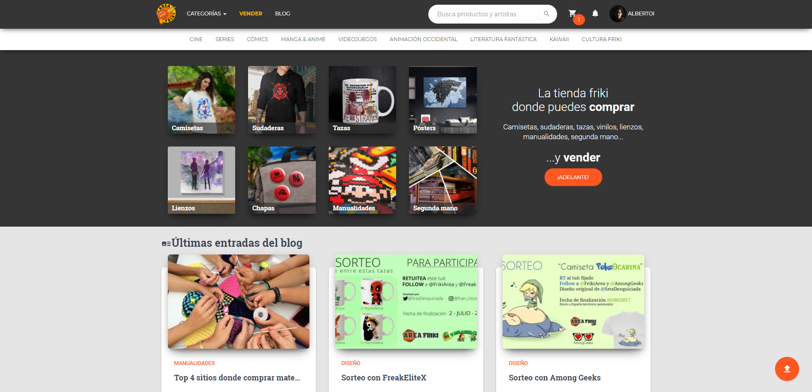

# Área Friki

> Proyecto antiguo, actualmente sin soporte. Este repositorio se conserva solo como referencia histórica.

## ¿Qué era Área Friki?

Área Friki fue una plataforma web para comprar y vender productos frikis, artesanales y de segunda mano. Permitía a los usuarios subir sus propios diseños, vender creaciones y gestionar una tienda online de forma gratuita.

### Principales funcionalidades
- **Marketplace**: Publicación y compra de productos frikis, artesanales y usados.
- **Gestión de usuarios**: Registro, login, panel de usuario y notificaciones.
- **Carrito y pedidos**: Sistema de carrito, gestión de pedidos y pagos (PayPal, Stripe, transferencia).
- **Panel de administración**: Moderación de productos, usuarios y pedidos.
- **Blog**: Sección de entradas y novedades.
- **Sistema de mailing y notificaciones**: Emails automáticos y notificaciones en la web.
- **Diseños y categorías**: Organización por categorías y diseños propios.

### Tecnologías utilizadas
- PHP (MVC propio)
- MySQL
- Bootstrap, Material Kit, jQuery
- Stripe, PayPal, PHPMailer

### Historia
El proyecto estuvo activo entre 2017 y 2022, con cientos de productos publicados y una comunidad de usuarios activos. Actualmente está discontinuado y no recibe soporte ni actualizaciones.

## Instalación
Este repositorio no está preparado para producción. Requiere configuración manual de base de datos y variables en `app/core/config.php`. No se recomienda su uso en entornos reales.

## Capturas de pantalla y logotipo

La web original estuvo en [areafriki.com](https://areafriki.com) (ya no disponible).

### Logotipo

### Ejemplo de la tienda

> El proyecto integraba tecnología PWA: permitía instalación en dispositivos y experiencia mejorada en móviles. Requería conexión online para funcionar.

## Contacto
Para cualquier consulta histórica, puedes contactar a:
- Alberto Oishii (albertooishii@gmail.com)

---

> Este proyecto es solo para consulta y aprendizaje. No se recomienda su uso comercial ni productivo.
